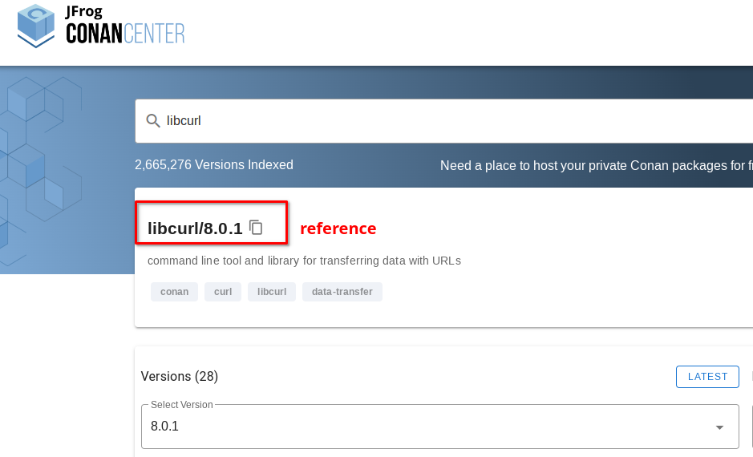

# C++ Project Skeleton

This project uses libcurl in c++ to print the content of this [file](https://raw.githubusercontent.com/samerbahri98/cpp-project-skeleton/main/content/ligmawhat.txt) from GitHub to the standard output

## How Is The Project Structured

- The `.cpp` ane the `.h` source files are in the `/src ` directory
- The `.o` files will be generated in the `/obj` directory.
Each `.o` file should correspond to a `.cpp` file (more on that later)
- The final binary is the main.out file (also generated) that could be invoked in the root of this project 
- Conan will generate random shell script files in the `/build` directory. do not pay it much attention.
---
## How To Build The Project

### Downloading The Basic Binaries
We need Conan, Build Essential, pkg-config.

 - Conan is the package manager. It will be used to download the c++ dependencies (libcurl in this instance)

 - Build Essential contains the gcc and g++ compilers and GNU Make. Make is our build tool, that will allow us to invoke the compiler and it will behave like a cli.

 - pkg-config is required to tell the compiler about the packages that Conan installed


Assuimg you are on Ubuntu:
```shell
sudo apt install -y pkg-config build-essential python3-pip
pip install conan
```
Then you will need to initalize Conan by running the follwing commands

```shell
conan profile detect --force
conan profile path default
```

### Downloading External Dependencies from Conan

In the root of this repository there is a `conanfile.txt` file. this file contains the list of the packages that our application needs. In this instance we only need libcurl.
You can find any package you need by searching the official repository [here](https://conan.io/center/). Once you find your desired package, copy its reference and paste it in the `conanfile.txt` requires section


finally, in the root of this repository run the following command
```shell
make install
```

This should download the packages that you need.
### Building The Application With GNU Make

 - [This](https://www.youtube.com/watch?v=GExnnTaBELk) Tutorial explains What a Makefile is and How to use it to build any project (It does not have to be a c/c++ project, it can literally be anything)

 - The Makefile written in this project works with any generic c++ project with a small adjustment. As seen in the tutorial, every `.cpp` file has a `.o` file. There are automated scripts to handle that automatically. **DO NOT CHANGE ANYTHING ELSE IN THE MAKEFILE**

 - to build your project, simply run
 ```

make
 ```
 - to run your project, simply run
 ```

./main.out
 ```
  - to clean up old binaries, simply run
 ```

make clean
 ```

 - feel free to add any phony targets to the makefile at your own risk.